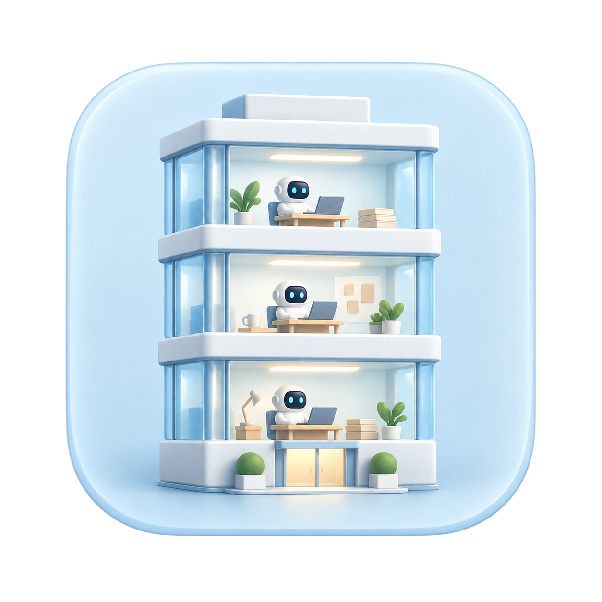

<p align="center">
  
</p>

# Cubirumi (큐비루미)

[English](README.md) · **한국어**

**AI 에이전트들이 일하는 나만의 작은 사무실.**

Cubirumi는 Codex와 Claude Code의 작업을 귀여운 미니어처 3D 사무실로 보여주는 로컬 오픈소스 앱입니다. 프로젝트는 층, 채팅은 작업구역, 에이전트는 직원이 됩니다. 옆에 띄워 두고 내 에이전트들이 어떤 상태인지 살펴보세요.

**[macOS 앱 다운로드](https://github.com/techjuicelab/cubirumi/releases/latest)** · [설치 안내](docs/DESKTOP.md) · [소스에서 실행](#소스에서-실행)

macOS 13.5 이상 · Apple Silicon / Intel · MIT 오픈소스

앱 화면과 상세 안내 문서는 현재 한국어입니다. 기본 README는 영어로, 이 문서는 한국어로 제공합니다.

<p align="center">
  
</p>

**누가 일하고 있는지, 어떤 작업을 하는지 한눈에.** 직원을 가까이에서 보거나, 자동 관찰을 켜고 작은 사무실을 천천히 둘러보세요.

| 프로젝트마다 한 층씩 | 내 팀의 사무실을 한눈에 |
| --- | --- |
|  |  |
| 여러 프로젝트의 작업을 건물 전체에서 살펴봅니다. | 층을 선택해 팀장과 직원들의 활동을 가까이에서 봅니다. |

<sub>개발용 Agent Office에서 촬영한 실제 사용 화면이며, 공개 앱 이름은 Cubirumi입니다. 화면의 ‘쉬는 층 숨기기’는 v0.3.0에 아직 포함되지 않은 개발 중 기능입니다.</sub>

<details>
<summary>개발 화면의 층 관리</summary>

현재 개발 버전은 한 시간 넘게 새 소식이 없는 층을 숨기고, 최근에 소식이 온 층부터 최대 8개를 보여줍니다. 작업·확인 요청·오류가 있는 층은 이 한도와 관계없이 표시합니다. 숨긴 층 수는 층 목록 아래에 표시합니다. 화면에서만 숨기므로 직원 기록을 종료나 퇴근으로 바꾸지 않으며, 새 소식이 오면 다시 표시 대상이 됩니다.

설정에서 숨김 기간을 30분~7일 또는 끄기로, 최대 층수를 4·6·8·10·12층 또는 제한 없음으로 바꿀 수 있습니다. **이 기능은 공개 다운로드 v0.3.0에 아직 포함되어 있지 않습니다.**

</details>

## 무엇을 볼 수 있나요?

- **프로젝트별 3D 사무실:** 프로젝트마다 층을 나누고, 같은 프로젝트의 여러 채팅과 하위 에이전트를 함께 봅니다.
- **살아 있는 작은 직원들:** 서로 다른 머리·의상·소품과 타이핑·페이지 넘김·기지개 같은 작은 동작으로 작업 상태를 표현합니다.
- **한눈에 보이는 업무:** 직원 명찰에 관측된 모델을 표시하고, 말풍선·빨간 링·업무별 소품으로 작업·승인 요청·오류를 구분합니다.
- **팀의 소통:** 관측된 업무 전달은 종이비행기로, 실제 승인 요청은 사장실 방문으로 표현합니다. 소통 기록도 확인할 수 있습니다.
- **내가 고르는 시점:** 층·직원 선택, 360도 회전·확대·이동, 자동 관찰과 30fps 절전 화면을 지원합니다. macOS 창을 항상 위에 둘 수도 있습니다.
- **우리 회사와 공용 에너지:** 회사명·사장 이름을 바꾸고, 연결된 계정의 공식 사용 한도와 초기화 시각을 확인합니다. 설정과 업무 기록은 로컬에 보관합니다.

Cubirumi는 관찰용 앱입니다. 업무 지시와 승인은 평소 사용하는 AI 앱에서 하며, 시각화 자체는 AI 모델을 호출하지 않습니다.

## 다운로드와 실행

### macOS 앱

1. [최신 릴리스](https://github.com/techjuicelab/cubirumi/releases/latest)에서 Apple Silicon Mac은 `arm64`, Intel Mac은 `x64` ZIP을 받습니다.
2. 압축을 풀고 `Cubirumi.app`을 응용 프로그램 폴더에 옮깁니다.
3. 앱을 열고 평소처럼 Codex 또는 연결된 Claude Code에서 작업합니다.

다운로드판에는 Node.js·로컬 서버·웹 화면이 들어 있어 별도 npm이나 저장소 설치가 필요 없습니다. macOS **13.5 이상**을 대상으로 합니다. 기존 소스 서버가 실행 중이라면 먼저 중지하세요. 두 방식은 같은 `4780` 포트를 사용합니다. `⌘Q`로 앱을 종료하면 자체 서버도 정리되며, 원래 Codex·Claude 작업은 종료하지 않습니다. 창만 닫으면 앱은 계속 실행됩니다.

현재 배포판은 Developer ID 서명·Apple 공증 없이 배포합니다. macOS가 실행을 막을 때의 안내는 [macOS 설치 안내](docs/DESKTOP.md#다운로드판-설치)를 참고하세요. 서명된 Sparkle 업데이트 피드를 사용하지만, 신규 Mac의 Gatekeeper 첫 실행과 실제 제품의 버전 간 업데이트는 추가 검증이 필요합니다.

### 소스에서 실행

Node.js **22.18 이상**, npm과 Git이 필요합니다. ZIP으로 소스를 받았다면 압축을 푼 폴더에서 `npm ci`부터 실행하세요.

```sh
git clone https://github.com/techjuicelab/cubirumi.git
cd cubirumi
npm ci
npm run build
npm start
```

**http://127.0.0.1:4780/** 을 엽니다. 종료는 터미널의 `Ctrl+C`입니다. Codex가 설치되어 있지 않아도 웹 화면과 Claude Code 이벤트 수신기를 사용할 수 있습니다.

## 에이전트 연결

### Codex

앱이나 로컬 서버가 실행되면 같은 컴퓨터의 Codex 실행 기록을 읽기 전용으로 관측하려고 시도합니다. 실제 연결이 없으면 출근 대기 화면이 나타납니다. 내부 SQLite/JSONL 형식에 의존하는 실험적 연결이며, 직접 보고된 모델과 상태만 표시합니다. hooks 지원 환경의 동봉 플러그인 설정은 [연결 안내](docs/INTEGRATIONS.md)를 참고하세요.

### Claude Code

Claude Code CLI가 설치되어 있고 터미널에서 `claude` 명령을 실행할 수 있어야 합니다. 다운로드판을 `/Applications/Cubirumi.app`으로 옮겨 첫 실행을 마친 뒤 다음 명령을 실행합니다.

```sh
cubirumi_app="/Applications/Cubirumi.app"
"$cubirumi_app/Contents/Helpers/node" "$cubirumi_app/Contents/Resources/runtime/scripts/install-claude.mjs" install
"$cubirumi_app/Contents/Helpers/node" "$cubirumi_app/Contents/Resources/runtime/scripts/install-claude.mjs" status
```

사용자 전용 응용 프로그램 폴더에 설치했다면 첫 줄을 `cubirumi_app="$HOME/Applications/Cubirumi.app"`로 바꿉니다. 내장 Node.js를 사용하므로 별도 Node.js 설치가 필요 없습니다.

소스에서 실행한다면 저장소 폴더에서 다음 명령을 사용합니다.

```sh
node scripts/install-claude.mjs install
node scripts/install-claude.mjs status
```

설치기는 사용자 범위에 플러그인을 등록하고, 기존 플러그인·표시줄 설정을 보존하며 백업합니다. **새 Claude Code 세션을 열어** 연결을 확인하세요. `status`는 등록된 설정 확인이며 실제 이벤트나 사용량 수신을 보장하지 않습니다. 연결 후에는 앱이나 소스 폴더의 설치 위치를 유지하세요.

[연결 안내](docs/CLAUDE_SETUP_PROMPT.md) · [실제 연결 확인](docs/CLAUDE_VERIFY_PROMPT.md)

## 사무실 둘러보기

| 조작 | 동작 |
| --- | --- |
| 층 또는 직원 선택 | 선택한 사무실이나 직원을 가까이에서 보기 |
| 건물 전체 보기 / macOS 앱의 `⌘0` | 자동 순회를 시작하지 않고 전체 건물 보기 |
| 자동 관찰 / `C` | 활동이 있는 층과 작업구역의 자동 관찰 시작·종료 |
| `Esc` | 자동 관찰 종료 |
| 휠·두 손가락 스크롤 | 확대·축소 |
| 드래그 | 회전 |
| 우클릭 드래그 또는 `Shift` + 드래그 | 화면 이동 |
| 설정 | 명찰·말풍선·관찰 간격·움직임 줄이기·절전 조절 |
| macOS 창 메뉴 / `⌘T` | 항상 위에 표시 전환 |

앱을 열거나 새로고침하면 수동 화면으로 시작합니다. 층·직원 선택이나 카메라 직접 조작은 자동 관찰을 종료하고 선택한 화면을 유지합니다. 다른 앱으로 포커스를 옮기거나 돌아와도 자동 관찰이 저절로 켜지지 않습니다.

작업 중인 직원은 빨간 링과 표식으로 강조합니다. 대기 직원과 사용하지 않는 책상은 장면에서 숨기고, 대기 기록은 전체 직원 목록에서 확인할 수 있습니다. 응답 종료만으로 세션 종료나 퇴근을 기록하지 않습니다.

**설정 → 우리 회사와 사장님**에서 회사명과 사장 이름을 바꿀 수 있습니다. 공개 기본값은 `나의 회사`와 `나`입니다. 터미널에서는 `npm run company -- "나의 스튜디오"`로 회사명을 바꾼 뒤 화면을 새로고침할 수 있습니다.

**공용 에너지**는 계정에서 공유하는 공식 사용 한도입니다. 누르면 시간대별 사용률·잔여량·초기화 시각을 봅니다. 지원되지 않거나 수신하지 못한 값은 미확인으로, 오래된 값은 관측 시각과 함께 표시합니다. 초기화 시각이 지났다고 잔여량을 자동으로 100%로 채우지 않습니다. [사용량 연결과 한계](docs/USAGE.md)

## 연결 범위

| 환경 | 현재 연결 |
| --- | --- |
| Codex Desktop / CLI 로컬 작업 | 실험적인 읽기 전용 실행 기록 관측 |
| Codex hooks 지원 환경 | 동봉 플러그인으로 lifecycle 이벤트 전송. 설치와 hook 신뢰 검토 필요 |
| Claude Code CLI | 플러그인으로 활동 이벤트 수신. 지원 계정은 공식 statusline 입력으로 사용 한도 수신 |
| Claude Desktop 로컬 Code 세션 | 공유 플러그인·hooks 설정 지원. Desktop만 사용할 때 사용 한도 보고는 확인되지 않았으며, 같은 계정의 터미널 CLI 세션이 값을 제공할 수 있음 |
| 일반 Claude Chat / Cowork | 전체 활동 관측 미지원 |
| 원격 호스트·클라우드 작업 | 해당 호스트의 별도 연결 없이는 관측 불가 |

macOS에서 실제 연결을 확인했습니다. GitHub CI는 Linux/macOS의 테스트·빌드를 포함하며, Windows 전체 동작은 아직 검증하지 않았습니다. Claude 설치기는 macOS와 Linux를 지원합니다.

## 관측의 의미와 개인정보

- **보고된 정보만 표시합니다.** 부모나 설정의 기본 모델로 자식 모델을 추정하지 않습니다. 모델이 누락되면 해당 직원의 로컬 기록으로 보완하되, 근거가 없으면 미확인으로 남깁니다.
- **응답 종료는 전체 업무 완료가 아닙니다.** 명시적인 종료 신호가 있을 때만 퇴근합니다. 애니메이션은 관측된 상태를 표현하며 비공개 사고 과정이나 정확한 진행률을 보여주지 않습니다.
- **전달과 승인에는 근거가 필요합니다.** 단순 실행 순서로 통신·승인 완료를 만들어내지 않습니다. 종이비행기는 실제 관측된 소통을 나타내고, 없는 직원을 생성하지 않습니다.
- **프롬프트·코드·도구 인수·결과 원문을 자동 전송하거나 저장하지 않습니다.** 프로젝트 폴더명·직원 별칭·모델·상태·연결 관계 같은 메타데이터를 로컬에 보관합니다.
- Claude hook은 실행 모델 확인을 위해 해당 세션·하위 에이전트의 로컬 기록 끝부분을 읽지만, 모델 식별자 외의 내용은 전송·저장·기록하지 않습니다. 최초 프롬프트가 들어갈 수 있는 DB 제목 필드도 읽지 않습니다.

기본 데이터 위치는 macOS의 `~/Library/Application Support/AgentOffice`, 그 외 환경의 `~/.local/share/agent-office`입니다. `AGENT_OFFICE_DATA_DIR`로 바꿀 수 있습니다. 회사명·사장 이름과 기록은 Git과 배포 번들에서 제외합니다.

최대 5,000개 이벤트와 512명 직원 상태를 보관합니다. 최초 로딩은 최근 200건, 열린 화면은 최대 500건, 소통 패널은 선택한 필터의 최근 100건을 표시합니다. 내부 기록 형식이 바뀌면 관측기 수정이 필요할 수 있습니다.

[업무 애니메이션](docs/ACTIVITY_ANIMATIONS.md) · [보안 안내](SECURITY.md) · [이벤트 API](server/API.md)

## 개발과 기여

```sh
npm run dev
npm test
npm run build
```

`npm run dev`는 UI `5173`과 이벤트 수신기 `4780`을 실행합니다. 기존 로컬 서버가 켜져 있다면 `npm run web`으로 UI만 실행하세요. 공개할 변경을 stage 한 뒤 `npm run check:public`으로 검사합니다.

`npm run desktop:install`은 별도 서버에 연결하는 개발용 `Agent Office.app` 창을 설치합니다. Node.js·서버를 포함한 배포 ZIP은 `npm run desktop:package`로 만듭니다. 소스 서버의 로그인 자동 실행은 `node scripts/install-runtime.mjs install`로 등록하고 `status`로 확인합니다. 저장소나 Node.js를 옮기려면 기존 서비스를 제거한 뒤 다시 설치하세요. `stop`만으로 자동 실행 등록 파일이 삭제되지는 않습니다. 다운로드판은 이 LaunchAgent가 필요 없습니다.

[기여 안내](CONTRIBUTING.md) · [앱 설치와 개발용 창](docs/DESKTOP.md) · [연결과 실행 관리](docs/INTEGRATIONS.md) · [릴리스 안내](docs/RELEASING.md)

실제 대화·개인 작업 기록·개인 경로가 보이는 자료를 공개 이슈에 올리지 마세요. 버그 제보에는 재현 절차와 개인정보를 제거한 예시를 사용하세요.

## 라이선스

자체 코드는 [MIT](LICENSE)입니다. Three.js의 MIT 고지와 글꼴의 SIL Open Font License 1.1을 보존합니다. [제3자 고지](public/THIRD_PARTY_NOTICES.txt) · [글꼴 출처](public/fonts/README.md)
