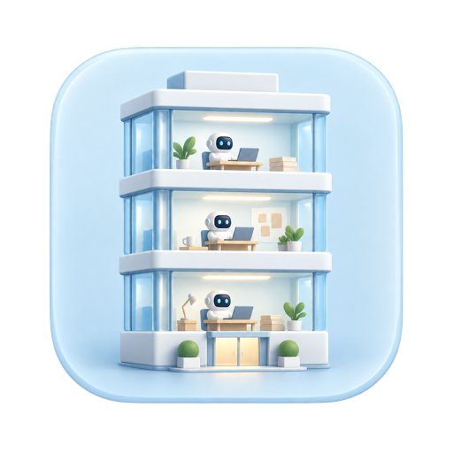
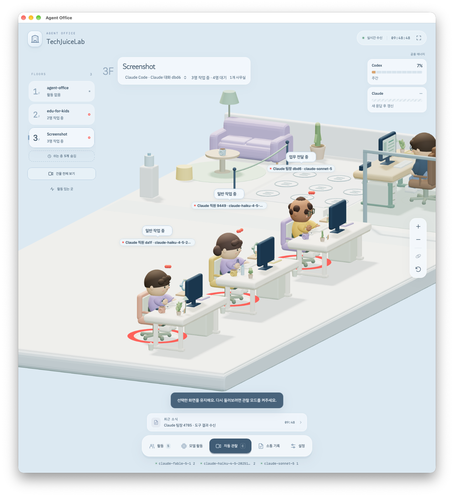
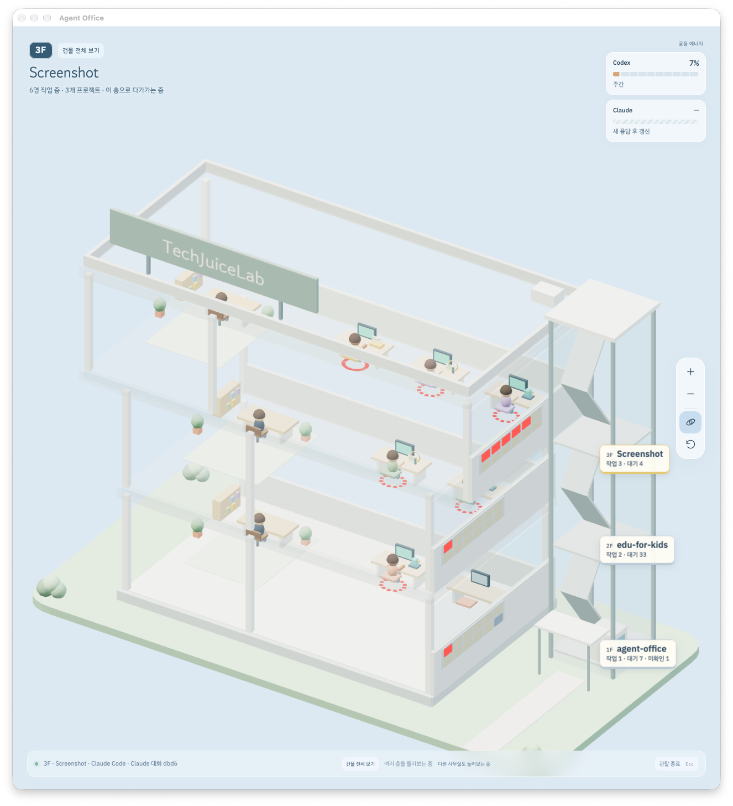
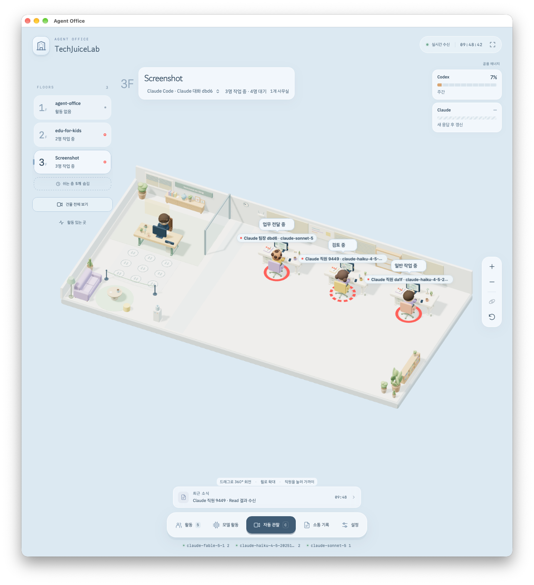

<p align="center">
  
</p>

# Cubirumi

**English** · [한국어](README.kr.md)

**A tiny office for your AI agents.**

Cubirumi is a local, open-source 3D office for observing Codex and Claude Code agents. Projects become floors, chats become work areas, and agents become little office workers.

**[Download for macOS](https://github.com/techjuicelab/cubirumi/releases/latest)** · [Installation guide](docs/DESKTOP.md) · [Run from source](#run-from-source)

macOS 13.5+ · Apple Silicon / Intel · MIT license

The app interface and detailed documentation are currently in Korean.

<p align="center">
  
</p>

**See who is working and what kind of work is happening.** Zoom in on an agent, or turn on automatic observation and take a slow tour of your miniature office.

### From one team to the whole building

| A floor for every project | Your team at a glance |
| --- | --- |
|  |  |
| Follow activity across multiple projects. | Select a floor to look closer at its agents. |

<sub>These screenshots show actual use of the development app, named Agent Office. The public app is named Cubirumi. The “hide idle floors” control shown in the screenshots is a development feature and is not included in v0.3.0.</sub>

<details>
<summary>Development preview: floor management</summary>

This preview is **not included in the public v0.3.0 release**. By default, the development version hides project floors with no new activity for an hour and shows up to eight recently active floors. Floors with work, pending approvals, or errors stay visible regardless of that limit. Settings offer an idle period from 30 minutes to seven days, or off, and a floor limit of 4, 6, 8, 10, or 12 floors, or unlimited. Hidden-floor counts appear below the floor list. Hiding a floor preserves its records and does not end its agents' sessions; new activity makes it eligible to appear again.

</details>

## What you can see

- **A miniature 3D workplace:** furnished offices, individual characters, small gestures, and a company name you can personalize.
- **Projects, chats, and agents:** switch between floors and conversations, with labels for agents, subagents, and their reported models.
- **Observed activity:** task bubbles, tool activity, code and document props, and clear markers for working, approval, and error states.
- **Communication and approvals:** paper airplanes visualize observed messages and handoffs; actual approval requests can bring an agent to the boss's office.
- **A view at your own pace:** rotate, zoom, pan, or follow active agents automatically, with reduced motion, a 30 fps power-saving option, and an always-on-top macOS window.
- **Shared usage and local history:** view supported account-wide Codex and Claude Code limits, along with locally saved activity that survives restarts.

Cubirumi is an observation companion. Give instructions and approve actions in your usual AI app. The visualization itself does not call AI models or modify the AI app's interface.

## Download and run

### macOS app

1. Open [GitHub Releases](https://github.com/techjuicelab/cubirumi/releases/latest) and download the ZIP for your Mac: `arm64` for Apple Silicon or `x64` for Intel.
2. Extract it, move `Cubirumi.app` to your Applications folder, and open it.
3. Connect your local agents using the steps below.

The download requires **macOS 13.5 or later** and includes Node.js, the local server, and the web interface. You do not need to install Node.js, npm, or this repository. The app starts its own server; quitting with `⌘Q` stops that server without stopping your Codex or Claude work. Closing only the window leaves the app running.

This early release is distributed without Apple Developer ID signing or notarization. See the [installation guide](docs/DESKTOP.md) for macOS first-open steps, signed automatic updates, and migration from a source installation. First launch on a fresh Mac and real upgrades between public releases still need further validation.

### Run from source

Requires **Node.js 22.18 or later**, npm, and Git. If you downloaded the source ZIP, extract it and start with `npm ci` in that folder.

```sh
git clone https://github.com/techjuicelab/cubirumi.git
cd cubirumi
npm ci
npm run build
npm start
```

Open **http://127.0.0.1:4780**. Stop the server with `Ctrl+C` in its terminal. You can run the office and Claude Code event receiver without Codex installed.

The downloaded app and source server use the same port. Stop an existing source server or login service before opening the downloaded app. See [migration and service instructions](docs/DESKTOP.md#기존-소스-설치에서-전환).

## Connect your agents

### Codex

Cubirumi automatically attempts to observe local Codex execution records when they are available. This is an experimental, read-only connection. In environments that support Codex hooks, the bundled plugin can also send lifecycle events after installation and review of hook permissions. See the [integration guide](docs/INTEGRATIONS.md).

### Claude Code

For the **downloaded macOS app**, move it to `/Applications/Cubirumi.app` and open it once. Then run these commands in a terminal where `claude` is available:

```sh
cubirumi_app="/Applications/Cubirumi.app"
"$cubirumi_app/Contents/Helpers/node" "$cubirumi_app/Contents/Resources/runtime/scripts/install-claude.mjs" install
"$cubirumi_app/Contents/Helpers/node" "$cubirumi_app/Contents/Resources/runtime/scripts/install-claude.mjs" status
```

If you installed it in your personal Applications folder, use `cubirumi_app="$HOME/Applications/Cubirumi.app"` instead. These commands use the app's bundled Node.js and do not require a source checkout. Keep the app at the same path after connecting it.

For a **source installation**, run from this repository:

```sh
node scripts/install-claude.mjs install
node scripts/install-claude.mjs status
```

The installer registers a user-scoped plugin, preserves existing plugins and statusline settings, and backs up the settings it changes. Start a **new Claude Code session** afterward. The `status` command checks registration; it does not prove that live events or usage limits are arriving. Follow the [live connection check](docs/CLAUDE_VERIFY_PROMPT.md) and [Claude setup guide](docs/CLAUDE_SETUP_PROMPT.md).

Claude Desktop's **local Code sessions** can share hooks and plugin settings. Usage reporting relies on the terminal Claude Code statusline; Desktop-only usage reporting is not confirmed. General Claude Chat and Cowork are outside this connection's scope.

## Explore your office

Connected projects appear as floors. Select a floor to see its chats together, or use the chat selector to focus on one conversation. If no agents are connected, Cubirumi shows a waiting screen.

| Action | Control |
| --- | --- |
| Look at a project or agent | Select a floor or a worker |
| See the whole building | **건물 전체 보기** (Building overview), or `⌘0` in the macOS app |
| Start or stop automatic observation | **자동 관찰** (Auto observe), or `C` |
| Stop automatic observation | `Esc` |
| Rotate the view | Drag |
| Zoom | Mouse wheel or trackpad pinch |
| Pan | `Shift` + drag or right-button drag |
| Keep the macOS window on top | Window menu, or `⌘T` |

Automatic observation starts only when you turn it on. It tours active floors and work areas, following agents at work. Selecting a floor or worker, or manually moving the camera, stops the tour and preserves your chosen view. Switching to another app and back does not turn the tour on. Settings control tour timing, camera tracking, task bubbles, reduced motion, and power saving.

Working agents have bright red markers. Waiting agents and unused desks are hidden from the scene, while their records remain in the full employee list. Projects remain as floors in v0.3.0. A completed response puts an agent into a waiting state; only an explicit end event marks the session as ended.

The energy cards show **shared account limits**, not an agent's stamina or performance. Click a card for details. Missing values stay unknown; older values are labeled with their observation time, and passing a reset time does not automatically refill them. See [usage sources and limitations](docs/USAGE.md).

To personalize the office, open **설정 → 우리 회사와 사장님** (Settings → Our company and boss), enter the names, and select **이름 저장** (Save names). Defaults are `나의 회사` (My company) and `나` (Me). Names are stored locally, outside the app bundle and repository. Source users can also run `npm run company -- "My studio"` and refresh the page.

## Supported connections

| Environment | Current support |
| --- | --- |
| Local Codex Desktop / CLI work | Experimental, read-only observation of execution records; only reported models and states are shown |
| Codex environments with hooks | Lifecycle events through the bundled plugin; installation and hook trust review are required |
| Claude Code CLI | Activity events through a user plugin; usage limits for supported accounts through official statusline input |
| Claude Desktop local Code sessions | Shared plugins and hooks; statusline execution was not observed in Desktop sessions, so Desktop-only usage reporting is unconfirmed. A terminal CLI session can report the same account's limits |
| General Claude Chat / Cowork | Full activity observation is not supported |
| Work on remote hosts or in the cloud | Requires a separate connection on the host where the work runs |

Live connections have been verified on macOS. The web server and read-only observer target Linux compatibility, and CI includes Linux and macOS tests. Full Windows operation has not been verified; the Claude installer supports macOS and Linux.

## Observation and privacy

### What the scene means

- **Models need evidence.** Cubirumi does not infer a subagent's model from its parent or defaults. When Claude hooks omit a model, it can use that agent's own local execution record; without matching agent, session, and time evidence, the model stays unknown.
- **Activity is not progress or proof of completion.** Animations describe observed activity categories, not private reasoning, actual keystrokes, or an exact completion percentage. A response ending does not mean the whole task succeeded.
- **Handoffs and approvals need observed events.** Execution order or a tool resuming is not enough to invent a transfer or approval. Paper airplanes represent observed communication; an agent's visit to the boss represents an actual approval request.
- **Connections can change.** Codex SQLite/JSONL and Claude JSONL observation depend on internal formats and may need adjustments after their apps update.

See [activity animations](docs/ACTIVITY_ANIMATIONS.md), [communication](docs/COMMUNICATION.md), and [integration limits](docs/INTEGRATIONS.md) for details.

### What stays on your computer

Cubirumi does not automatically transmit or store raw prompts, code, tool arguments, or tool results. It stores local metadata such as project folder names, agent aliases, models, activity states, and connections. It does not read database title fields that may contain the first prompt. Claude model detection reads the end of the relevant local session or subagent transcript, but does not forward, store, or log its contents beyond model identifiers.

The default data directory is `~/Library/Application Support/AgentOffice` on macOS and `~/.local/share/agent-office` elsewhere. Override it with `AGENT_OFFICE_DATA_DIR`. Personal names and activity records are excluded from Git and release bundles. Storage retains up to 5,000 events and 512 agent states; the UI initially loads 200 recent events and keeps up to 500, while the communication panel shows the latest 100 matching its filter.

[Security policy](SECURITY.md) · [Event API](server/API.md)

## Development and contributing

After installing dependencies:

```sh
npm run dev
npm test
npm run build
```

`npm run dev` starts the development UI on port `5173` and the event receiver on `4780`. If a local receiver is already running, use `npm run web` for the UI only. After staging changes, run `npm run check:public` to check the public files.

`npm run desktop:install` creates the development macOS window, which connects to a separate local server. `npm run desktop:package` builds the downloadable app with its own Node.js and server. For source installations, login startup can be registered with `node scripts/install-runtime.mjs install` and checked with `node scripts/install-runtime.mjs status`. The downloaded app does not need that service. Remove an old service before moving the repository or Node.js; `stop` alone does not remove its login registration. See the [desktop guide](docs/DESKTOP.md) and [integration guide](docs/INTEGRATIONS.md).

See [CONTRIBUTING.md](CONTRIBUTING.md) for development and bug reports, and the [release guide](docs/RELEASING.md) for packaging and update signing. Before sharing screenshots or issues, remove private conversations, work records, personal names, and paths.

## License

Cubirumi's own code is licensed under [MIT](LICENSE). Third-party MIT notices and the fonts' SIL Open Font License 1.1 are retained. See [third-party notices](public/THIRD_PARTY_NOTICES.txt) and [font sources](public/fonts/README.md).
